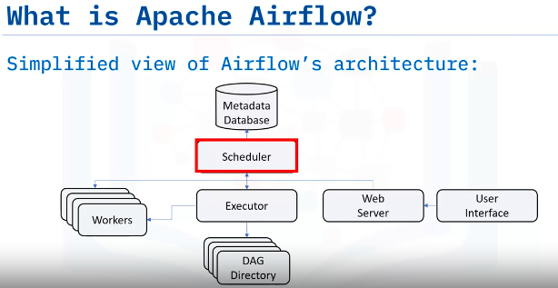
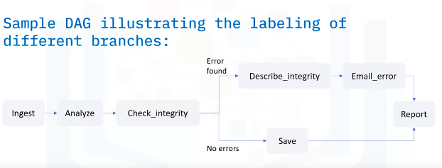
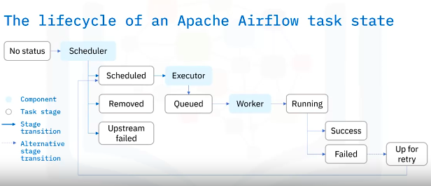
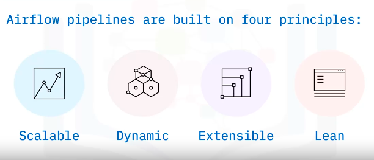

# Apache Airflow Overview
Apache Airflow is a powerful open-source workflow orchestration tool primarily used for building and managing batch data pipelines. Here's a breakdown of the main components, features, principles, and common use cases of Apache Airflow:

### Components:
1. **Scheduler:** Responsible for triggering scheduled workflows and submitting tasks to the Executor.
2. **Executor:** Executes tasks by assigning them to Workers.
3. **Web Server:** Provides an interactive User Interface for monitoring, triggering, and debugging workflows.
4. **DAG Directory:** Contains all DAG files, accessible by the Scheduler, Executor, and Workers.

5. **Metadata Database:** Stores the state of each DAG and its tasks.

### Task Lifecycle:
- Tasks transition through various states during their lifecycle, including Scheduled, Queued, Running, Success, Failed, and Up for retry.

### Features:

1. **Pure Python:** Workflows are created using standard Python, offering flexibility.

2. **Useful UI:** Sophisticated web app for monitoring, scheduling, and managing workflows.

3. **Integration:** Plug-and-play integrations with various services and systems.

4. **Easy to Use:** Anyone with Python knowledge can deploy a workflow.

5. **Open Source:** Active community for sharing improvements and experiences.

### Principles:
1. **Scalable:** Modular architecture with message queue for orchestrating an arbitrary number of workers.
2. **Dynamic:** Python-based pipelines allow dynamic generation and multiple simultaneous tasks.
3. **Extensible:** Define custom operators and extend libraries to suit specific requirements.
4. **Lean:** Lean and explicit pipelines with parameterization using Jinja templating engine.

### Common Use Cases:
1. Defining and organizing machine learning pipeline dependencies.
2. Increasing visibility and decoupling of batch processes.
3. Enterprise scheduling tool for batch processes.
4. Orchestration of SQL transformations in data warehouses.
5. Sending daily analytics emails.

In summary, Apache Airflow is a versatile platform for authoring, scheduling, and monitoring workflows, offering features such as Python-based workflows, a useful UI, integrations, ease of use, scalability, dynamism, extensibility, and openness to support various data pipeline use cases.