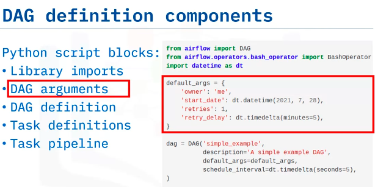
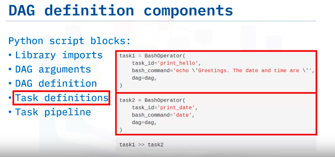

**Advantages of Representing Data Pipelines as DAGs in Apache Airflow**

**Introduction to DAGs:**
- A Directed Acyclic Graph (DAG) is a specialized type of graph without loops.
- DAGs represent workflows or pipelines in Apache Airflow.
- Tasks in a pipeline are nodes in a DAG, and dependencies between tasks are represented as directed edges.

**Components of a DAG:**
- DAGs are defined in Python scripts, representing the structure of the workflow.
- Tasks and dependencies are defined as code within the DAG script.
- Components include library imports, DAG arguments, DAG definition, task definitions, and task pipelines.

**Task Definition and Operators:**
- Each task in a DAG is written in Python and implemented as an operator.
- Operators define specific actions for tasks, such as deploying Python code, running SQL queries, or executing Bash commands.
- Sensors, a class of operators, are used to poll for conditions to be met before proceeding with a task.

**Apache Airflow Scheduler:**
- Airflow Scheduler is a persistent service that deploys workflows on an array of workers.
- It follows task dependencies specified in the DAG script.
- DAGs start running based on specified start dates and schedule intervals.

**Key Advantages:**
- Workflows defined as code are more maintainable, as developers can explicitly follow the specified logic.
- Code revisions can be easily tracked using version control systems like Git.
- Collaboration among development teams is facilitated for both development and maintenance.
- Code revisions can be tested through unit tests to ensure functionality.

**Conclusion:**
- Apache Airflow represents workflows as Python code, making them more maintainable, testable, and collaborative compared to traditional approaches.

Feel free to let me know if you need further clarification or assistance with anything else!