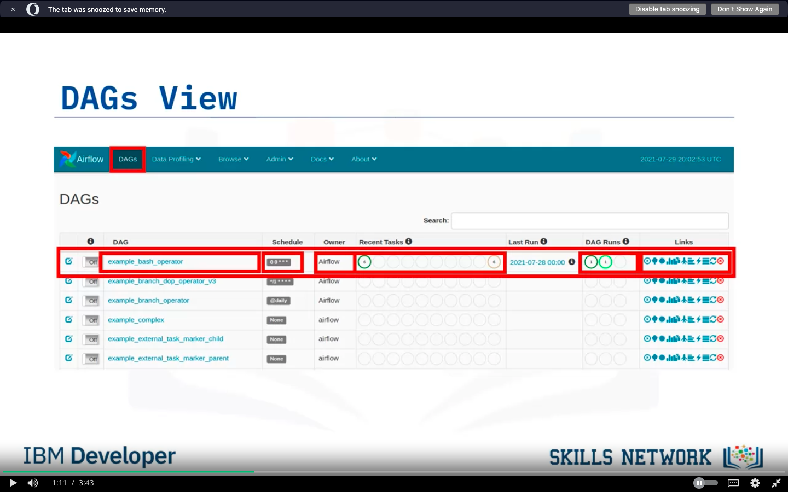

**Welcome to Apache Airflow UI!**

**Overview:**
- Apache Airflow UI provides a user-friendly interface for managing and monitoring data pipelines.
- After watching this video, you'll be able to identify current DAGs, visualize DAGs in different ways, review DAG code, analyze task durations, and select context metadata for task instances.

**DAGs View:**
- The landing page displays the "DAGs View," showing a table with information about each DAG in your environment.
- It includes details such as DAG name, run schedule, owner, task status for the current or most recent run, status of previous runs, and quick links for more information.

**Visualizing DAGs:**

- Clicking on a DAG's name opens the "Tree View" by default, displaying a timeline of DAG and task statuses for each run.

- "Graph View" shows the DAG's tasks and dependencies, color-coded by operator type. You can filter the view by task status.

- Both views allow access to the "Task Instance Context Menu," enabling you to drill down into task details or view task logs.
- Clicking the "Code" button reveals the Python source code defining the DAG, including library imports and task definitions.

**Analyzing Task Durations:**
- "Task Duration" provides a timeline chart of task durations, highlighting the performance of each task over multiple runs.
- You can toggle to highlight tasks for the last N runs, aiding in performance analysis and optimization.

**Key Takeaways:**
- Apache Airflow UI offers various visualization options for DAGs, including tree and graph modes.
- You can review the Python code defining your DAGs and analyze task durations for optimization.
- The UI allows you to select context metadata for any task instance, facilitating detailed monitoring and management of data pipelines.

In summary, Apache Airflow UI simplifies the management and monitoring of data pipelines by providing intuitive visualization tools, code review capabilities, and performance analysis features.