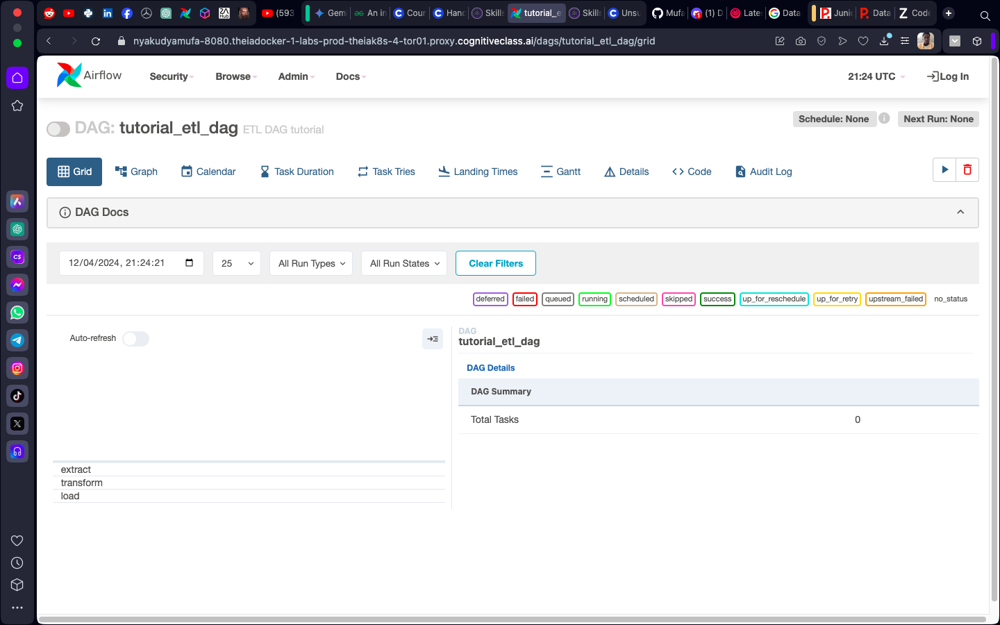
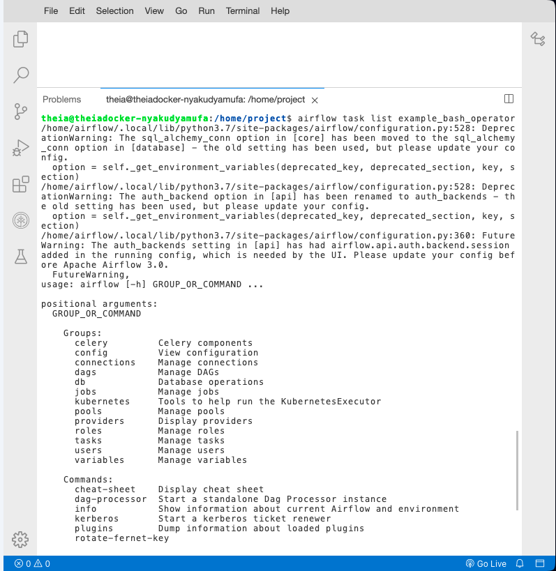

# Hands-on Lab: Getting started with Apache Airflow

**Estimated time needed:** 20 minutes

## Objectives

After completing this lab you will be able to:

- Start Apache Airflow.
- Open the Airflow UI in a browser.
- List all the DAGs.
- List the tasks in a DAG.
- Explore a DAG in the UI.

# About Skills Network Cloud IDE

Skills Network Cloud IDE (based on Theia and Docker) provides an environment for hands-on labs for course and project-related labs. Theia is an open-source IDE (Integrated Development Environment) that can be run on desktop or in the cloud. To complete this lab, we will be using the Cloud IDE based on Theia running in a Docker container.

## Important Notice about this lab environment

Please be aware that sessions for this lab environment are not persistent. A new environment is created for you every time you connect to this lab. Any data you may have saved in an earlier session will get lost. To avoid losing your data, please plan to complete these labs in a single session.


## Exercise 1 - Start Apache Airflow

1. Open a new terminal by clicking on the menu bar and selecting Terminal -> New Terminal, as shown in the image below.


   This will open a new terminal at the bottom of the screen as shown in the image below.


2. Run the following command in the newly opened terminal. (You can copy the code by clicking on the little copy button on the bottom right of the code block below and paste it wherever you wish.)

   ```bash
   start_airflow
   ```

   

   Please be patient, it may take up to 5 minutes for Airflow to start.


3. When Airflow starts successfully, you should see an output similar to the one below.

   


## Exercise 2 - Open the Airflow Web UI

1. Copy the Web-UI URL and paste it into a new browser tab. You can also click on the URL by holding the control key (Command key on a Mac).

2. You should land on a page that looks like this:


3. You can Unpause/Pause a DAG using the Unpause/Pause toggle button.


4. An unpaused DAG looks like this:


5. Click on a DAG to explore more about the DAG.




6. Click on the Grid button to see the grid view of the DAG.


7. Click on the Graph button to see the graph view of the DAG.


Apache Airflow provides some handy command-line options to work with.

Run the following command in the terminal to list all existing DAGs:

```bash
airflow dags list
```


## Exercise 4 - List tasks in a DAG

Run the following command in the terminal to list all tasks in the DAG named `example_bash_operator`:


```bash
airflow tasks list example_bash_operator
```




Here, `example_bash_operator` is the name of the DAG.


Try listing out the tasks for the DAG `tutorial`:

```bash
airflow tasks list tutorial
```

This will display a list of all tasks configured within the specified DAG. Let me know if you need further assistance!


## Exercise 5 - Pause/Unpause a DAG

Run the following command in the terminal to unpause a DAG:

```bash
airflow dags unpause tutorial
```

Here, `tutorial` is the name of the DAG.

Pause a DAG:

```bash
airflow dags pause tutorial
```

The dag ```tutorial``` is paused so we can unpause it using the bash command below

```bash
airflow dags unpause tutorial
```


Try to unpause the DAG named `example_branch_operator`:

```bash
airflow dags unpause example_branch_operator
```

This will either unpause or pause the specified DAG based on the command used. Let me know if you need further assistance!


# Practice Exercises

**Problem 1:**  
List tasks for the DAG `example_branch_labels`.

<details>
<summary><b>Hint:</b> Click to reveal solution</summary>

Use the `list` option.

**Solution:**  
```bash
airflow tasks list example_branch_labels
```
</details>

---

**Problem 2:**  
Unpause the DAG `example_branch_labels`.

<details>
<summary><b>Hint:</b> Click to reveal solution</summary>

Use the `unpause` option.

**Solution:**  
```bash
airflow dags unpause example_branch_labels
```
</details>

---

**Problem 3:**  
Pause the DAG `example_branch_labels`.

<details>
<summary><b>Hint:</b> Click to reveal solution</summary>

Use the `pause` option.

**Solution:**  
```bash
airflow dags pause example_branch_labels
```
</details>

---
